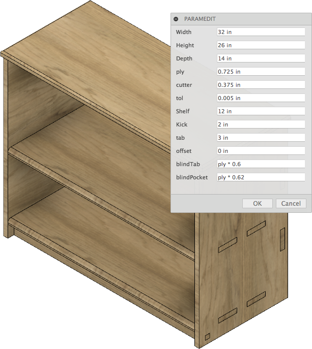
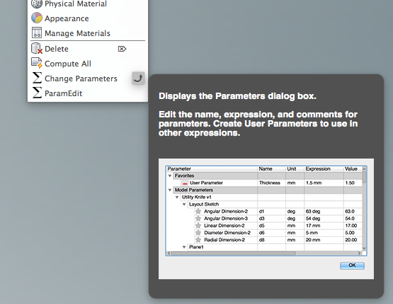

#  EditParam

This is an [Autodesk Fusion 360](http://fusion360.autodesk.com/) script that's used for simply editing user parameters.

# Installation
[Click here to download the Add-in](https://github.com/tapnair/ParamEdit/archive/master.zip)

After downloading the zip file follow the [installation instructions here](https://tapnair.github.io/installation.html) for your particular OS version of Fusion 360 

## Usage

1. Enter the Model environment
2. You can create User parameters to drive dimensions in your design here:
  - Select Modify->Change Parameters

    
3. Now you can easily modify and User Generated parameters in a simplified UI by selecting paramEdit
  - Select Modify->paramEdit
  - Update changes are now previewed live in the UI

## License
Samples are licensed under the terms of the [MIT License](http://opensource.org/licenses/MIT). Please see the [LICENSE](LICENSE) file for full details.

## Written by

Written by [Patrick Rainsberry](https://twitter.com/prrainsberry)   (Autodesk Fusion 360 Business Development)

See more useful [Fusion 360 Utilities](https://tapnair.github.io/index.html)

