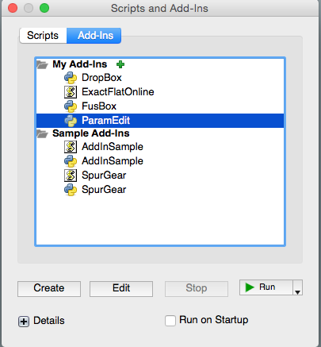

#  EditParam

This is an [Autodesk Fusion 360](http://fusion360.autodesk.com/) script that's used for simply editing user parameters.

## Installation

Copy the "ParamEdit" folder into your Fusion 360 "Addins" folder. You may find this folder using the following steps:

1. Start Fusion 360 and then select the File -> Scripts... menu item
2. The Scripts Manager dialog will appear and display the "My Scripts" folder and "Sample Scripts" folders
3. Click on Addins at the top of the dialog box
4. Select one of the "My Addins" files and then click on the "+" Details icon near the bottom of the dialog.
  - If there are no files in the "My Addins" folder then create a default one.
  - Click the Create button, select Python, and then OK.
5. With the user addin selected, click the Full Path "..." button to display a file explorer window that will display the "Addins" folder
6. Copy this addin folder into this location

For example, on my Mac the folder is located in:

/Users/USERNAME/Library/Application Support/Autodesk/Autodesk Fusion 360/API/Addins/

7. Next time you start Fusion the addin will be in the list.  Or you can select the green plus sign and browse to paramedit.py

    
## Usage

1. Enter the Model environment
2. You can create User parameters to drive dimensions in your design here:
  - Select Modify->Change Parameters

    
3. Now you can easily modify and User Generated parameters in a simplified UI by selecting paramEdit
  - Select Modify->paramEdit
  - Update changes are now previewed live in the UI

## License
Samples are licensed under the terms of the [MIT License](http://opensource.org/licenses/MIT). Please see the [LICENSE](LICENSE) file for full details.

## Written by

Written by [Patrick Rainsberry](https://twitter.com/prrainsberry)   (Autodesk Fusion 360 Business Development)

See more useful [Fusion 360 Utilities](https://tapnair.github.io/index.html)

## License
Samples are licensed under the terms of the [MIT License](http://opensource.org/licenses/MIT). Please see the [LICENSE](LICENSE) file for full details.

## Written by

Written by [Patrick Rainsberry](https://twitter.com/prrainsberry)   (Autodesk Fusion 360 Business Development)

See more useful [Fusion 360 Utilities](https://tapnair.github.io/index.html)

